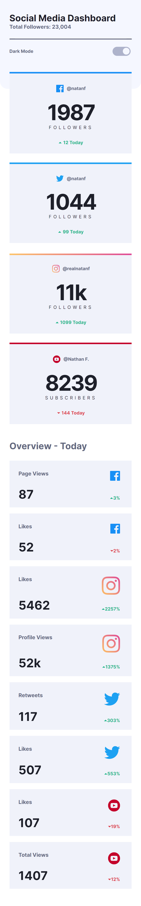
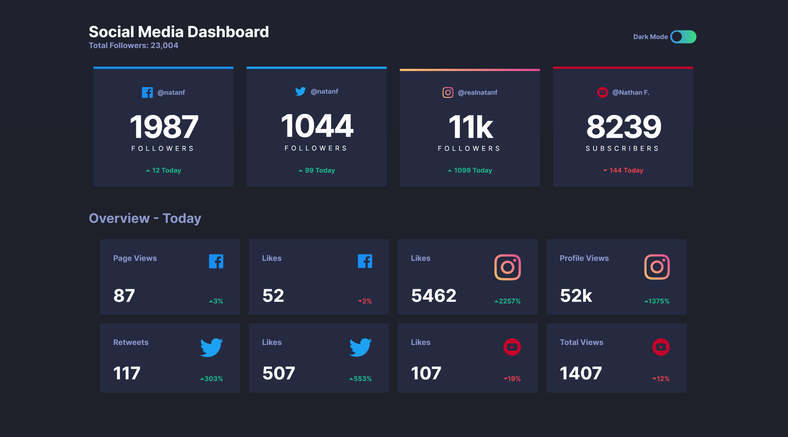

# Frontend Mentor - Social media dashboard

Esta é uma solução para o desafio [Social media dashboard with theme switcher no Fronend Mentor](https://www.frontendmentor.io/challenges/social-media-dashboard-with-theme-switcher-6oY8ozp_H).  Os desafios do Frontend Mentor ajudam a melhorar suas habilidades de codificação através da construção de projetos realistas.

# Índice

- [Resumo](#resumo)
  - [Desafio](#desafio)
  - [Screenshot](#screenshot)
  - [Links](#links)
- [Processo](#processo)
  - [Construção](#construção)
  - [Aprendizado](#aprendizado)
- [Recursos](#recursos)
- [Autor](#autor)

<br>

# Resumo

## Desafio

<br>

Este projeto consiste em um dashboard fictício para análise de redes sociais, que conta com um design responsivo e opções para alteração de tema. Através do dashboard, é possível visualizar informações importantes sobre as redes sociais em questão, como número de seguidores, engajamento e outras métricas relevantes.

Os usuários devem ser capazes de:

- Visualizar o layout ideal para o site, dependendo do tamanho da tela do dispositivo;
- Interagir com elementos na página;
- Alternar o tema da cor à sua preferência.

<br>

## Screenshot

### **Mobile**

<p style="text-align:center;">
    </img>
</p>

<br>

### **Desktop**

<p style="text-align:center;">
    </img>
</p>

<br>

## Links

- Site: [Dashboard](https://09-social-media-dashboard.vercel.app);

<br>

# Processo

## Construção

<br>

- **HTML:**
  - Marcação semântica;
  - Metodologia BEM.
- **Sass/Scss:**
  - Divisão de responsabilidade em diferentes arquivos;
  - Pseudo-classe e pseudo-elemento;
  - Variáveis;
  - Flexbox;
  - Elementos interativos.

<br>

## Aprendizado

<br>

### **HTML**

***Marcação para criar um botão Toggle Switch***

```html
<section class="intro__toggle-button">
    <p class="toggle__title">Dark Mode</p>
    <input type="checkbox" class="toggle__button" id="toggle-thema">
</section>
```

<br>

### **SCSS**

***Utilizar a pseudo-elemento ```::before``` para criar sobreposição de cores no background***

``` scss
body {
    position: relative;
    background-color: var(--background);
    padding: 3.6rem 2.5rem 4.6rem 2.5rem;
    z-index: 0;
    
    &::before {
        content: "";
        position: absolute;
        top: 0;
        left: 0;
        width: 100%;
        height: 23.5rem;
        border-radius: 0 0 2rem 2rem;
        background-color: var(--top-background);
        z-index: -1;
      }
}
```

<br>

***Estilização para criar um botão Toggle Switch***

```scss
.intro__toggle-button {
            display: flex;
            justify-content: space-between;
            align-items: center;
            margin: 1.6rem 0 4rem;

            .toggle__title {
                @include text ($def-mobile, $w7, var(--sub-text));
            }

            .toggle__button {
                position: relative;
                width: 4.8rem;
                height: 2.4rem;
                appearance: none;
                background-color: var(--toggle);
                border-radius: 2rem;
                cursor: pointer;
                transition: .4s;

                &:hover {
                    background-image: var(--dt-toggle);
                }

                &:checked {
                    background-image: var(--dt-toggle);
                }

                &::before {
                    content: '';
                    position: absolute;
                    top: 3px;
                    right: 3px;
                    bottom: 3px;
                    width: 1.8rem;
                    height: 1.8rem;
                    background-color: var(--top-background);
                    border-radius: 50%;
                    transition: .4s;
                }

                &:checked:before {
                    transform: translateX(-2.4rem);
                }
            }
        }
```

<br>

***Utilizar a sintaxe de variáveis css para exportar-las como ```:root```***

```scss
:root {
    // Dark theme
    --dt-toggle: linear-gradient(to right, hsl(210, 78%, 56%), hsl(146, 68%, 55%)); // Toggle button
    --dt-top-background: hsl(232, 19%, 15%); // Top background
    --dt-background: hsl(230, 17%, 14%); // Background 
    --dt-card-background: hsl(228, 28%, 20%); // Card background
    --dt-main-text: hsl(0, 0%, 100%); // Text main
    --dt-sub-text: hsl(228, 34%, 66%); // Text secondary
    --dt-hover: hsl(228, 26%, 27%);
    // Light theme
    --lt-toggle: hsl(230, 22%, 74%); // Toggle button
    --lt-top-background: hsl(225, 100%, 98%); // Top backgroun
    --lt-background: hsl(0, 0%, 100%); // Background
    --lt-card-background: hsl(227, 47%, 96%); // Card background
    --lt-main-text: hsl(230, 17%, 14%); // Text main
    --lt-sub-text: hsl(228, 12%, 44%); // Text secondary
    --lt-hover: hsl(232, 33%, 91%);
}
```

# Recursos
- [Toggle Switch](https://www.w3schools.com/howto/howto_css_switch.asp) 

# Autor

- Site pessoal - [Mathews Mattar](https://www.linkedin.com/in/mathewsmattar/)
